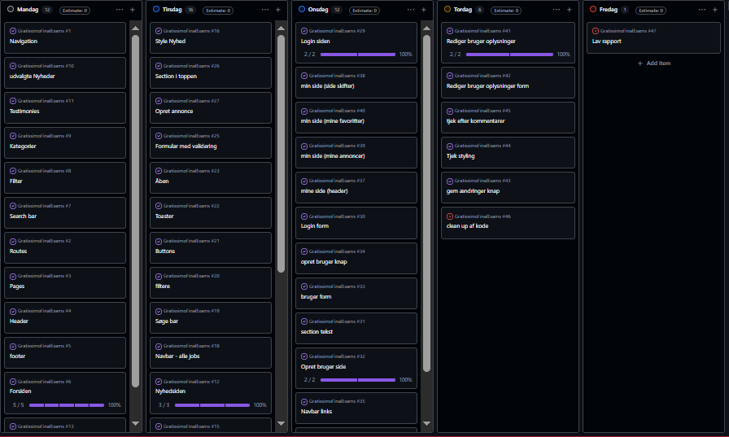

# Svendeprøve

## Rapport

- Sebastian Larsen
- H1WE080125
- [Github Link](https://github.com/BeastTheNinja/GratissimoFinalExams)
- Brugernavn: <tester@tester.dk> - password: tester

## Indholdsfortegnelse

- [Indledning](#indledning)
- [Vurdering af egen indsats](#vurdering-af-egen-indsats)
- [Redegørelse for kodeelementer](#redegørelse-for-oprindelsen-af-de-forskellige-kodeelementer-i-prøven)
- [Fremhævelse af punkter til bedømmelse](#fremhævelse-af-punkter-til-bedømmelse)
- [Bilag: Tids plan](#bilag-tids-plan)
- [Links: Links](#links)
- [Konklusion](#konklusion)

---

## Indledning

Du arbejder i en nyopstartet virksomhed som webudvikler med speciale i frontend
udvikling. I en typisk arbejdssituation er du bindeleddet mellem mediegrafikeren og
backend udvikleren. Din rolle er at formidle det data, som backend udvikleren
leverer, efter mediegrafikerens anvisninger.  

Du har fået til opgave at bygge en frontend løsning til Gratissimo, som er en jobportal
for frivillige og foreninger. På Gratissimo kan foreninger slå jobs op som de søger
frivillig arbejdskraft til. Ligeledes kan brugere af siden finde jobannoncer gennem
søgning og filtrering, læse nyheder fra siden eller gemme favorit annoncer.

Mediegrafikeren har leveret et godkendt design, som du skal sætte sitet op efter.
Backend udvikleren har leveret et webbaseret API som du kan styre sitets indhold fra.
API’et er bygget i NodeJS og kan hentes fra et Github repository og installeres og
afvikles på din lokale maskine.

---

## Vurdering af egen indsats

Jeg synes at jeg har arbejdet struktureret med projektet, og fået implementeret de vigtigste funktioner. Jeg har især haft fokus på, at brugeren skulle kunne søge efter job, filtrere resultaterne og gemme interessante jobopslag som favoritter.

Et af de områder, jeg havde sværest ved, var at få `URLSearchParams` til at
fungere sammen med søgning og filtrering. Jeg skulle undersøge, hvordan
søgeparametre kunne gemmes i URL'en, så resultatet kunne genindlæses uden at søgeparametrene forsvandt.

Jeg havde også udfordringer med at bruge `Set` til at fjerne dubletter fra
filterværdierne. Efter at have undersøgt funktionen kunne jeg bruge den til at vise hver region, kategori og arbejdstype én gang.

Favoritfunktionen krævede også en del arbejde, fordi brugeren først skulle
kontrolleres, før jobbet kunne gemmes. Jeg løste dette ved at kontrollere
login-status, sende jobbets id til API'et og vise en besked til brugeren, hvis handlingen lykkedes eller fejlede.

Jeg vurderer derfor, at jeg har opnået en god forståelse af samspillet mellem React, API-kald og brugerinteraktion. Hvis jeg skulle arbejde videre med projektet, ville jeg blandt andet forbedre valideringen og give brugeren mere feedback ved sletning og gemning af favoritter.

---

## Redegørelse for oprindelsen af de forskellige kodeelementer i prøven

### Søgning med URLSearchParams

Jeg valgte at gemme søgningen i URL'en ved hjælp af `URLSearchParams`.
Det var et område, jeg skulle undersøge, fordi jeg gerne ville have, at
søgeresultatet kunne genindlæses eller deles uden at søgningen forsvandt.

Når brugeren søger, opretter jeg et nyt `URLSearchParams`-objekt. Derefter
tilføjes søgeteksten og de valgte filtre som URL-parametre.

```tsx
function handleSearch(query: string) {
    const params = new URLSearchParams();

    if (query) {
        params.set("q", query);
    }

    Object.entries(filters).forEach(([key, value]) => {
        if (value) {
            params.set(key, value);
        }
    });

    setSearchParams(params);
}
```

På resultatsiden hentes parametrene fra URL'en og bruges som en del af
endpointet til API'et:

```tsx
const queryString = searchParams.toString();

const endpoint = `/api/job-listings${
    queryString ? `?${queryString}` : ""
}`;
```

På den måde bliver søgningen en del af sidens adresse. Det betyder, at
resultatet ikke kun findes midlertidigt i React state.

### Set til unikke filterværdier

Jeg brugte også `Set`, fordi flere jobopslag kan have samme region,
kategori eller arbejdstype. Uden `Set` ville de samme værdier blive vist
flere gange i filteret.

```tsx
const regions = [
    ...new Set((jobs ?? []).map((job) => job.region.name)),
];
```

`map` laver først en liste med alle regionerne. `Set` fjerner derefter
dubletterne, og spread-operatoren laver resultatet om til et almindeligt
array igen, som kan sendes videre til filterkomponenten

### Gemme favoritter

For at gemme et job undersøger jeg først, om brugeren er logget ind. Hvis
brugeren ikke er logget ind, vises en fejlbesked. Hvis brugeren er logget
ind, sendes jobbets id til backendens favorit-endpoint.

```tsx
async function handleSave(jobListingId: number) {
    try {
        const loggedIn = await isLoggedIn();

        if (!loggedIn) {
            setToast({
                message: "Du skal være logget ind for at gemme et job.",
                type: "error",
            });

            return;
        }

        await saveFavorite(jobListingId);

        setToast({
            message: "Jobbet er gemt.",
            type: "success",
        });
    } catch {
        setToast({
            message: "Jobbet kunne ikke gemmes.",
            type: "error",
        });
    }
}
```

Selve API-kaldet ligger i en separat service:

```tsx
export function saveFavorite(jobListingId: number) {
    return api("/api/favorites", {
        method: "POST",
        body: JSON.stringify({ jobListingId }),
    });
}
```

Jeg valgte at placere API-kaldet i en servicefil, så komponenten primært
står for brugerens interaktion og visning af beskeder.

---

## Fremhævelse af punkter til bedømmelse

### Komponentbaseret udvikling

Projektet er bygget op af mindre React-komponenter, som hver har deres eget
ansvar. Eksempelvis har jeg separate komponenter til søgefelt, filtre,
jobliste, formularer og fejlbeskeder. Det gør koden mere overskuelig og gør det muligt at genbruge komponenterne flere steder i projektet.

### API-integration

Frontend'en henter og sender data til backendens API. Jobopslag hentes fra
API'et, og brugeren kan både oprette annoncer og gemme favoritter. Jeg har
placeret API-kald i servicefiler, så komponenterne primært håndterer visning og brugerinteraktion.

### Søgning og filtrering

Jeg har brugt `URLSearchParams` til at gemme søgetekst og filtre i URL'en.
Det gør, at en søgning kan genindlæses og deles med andre. Jeg har også brugt `Set` til at fjerne dubletter fra de værdier, der vises i filtrene.

### Brugerlogin og favoritter

Brugere kan logge ind og gemme jobopslag som favoritter. Før et job gemmes,
kontrolleres det, om brugeren er logget ind. Hvis brugeren ikke er logget ind, vises en fejlbesked. Hvis brugeren er logget ind, sendes jobbets id til backendens favorit-endpoint.

### Fejlhåndtering og brugerfeedback

Jeg har arbejdet med loading- og fejltilstande ved API-kald. Brugeren får
feedback, mens data hentes, og hvis et API-kald fejler. Ved gemning af
favoritter bruger jeg en toaster-besked til at vise, om handlingen lykkedes.

### Samarbejde mellem frontend og backend

Min opgave har været at modtage data fra backendens API og vise det efter det godkendte design. Det har blandt andet krævet, at jeg forstod API'ets
endpoints, datatyper og hvilke oplysninger der skulle sendes ved POST- og
DELETE-kald.

---

## Bilag: Tids plan



---

## Links

- [:nth-child](https://developer.mozilla.org/en-US/docs/Web/CSS/Reference/Selectors/:nth-child)

- [Child combinator](https://developer.mozilla.org/en-US/docs/Web/CSS/Reference/Selectors/Child_combinator)

- [useSearchParams](https://reactrouter.com/api/hooks/useSearchParams#summary)

- [Set](https://developer.mozilla.org/en-US/docs/Web/JavaScript/Reference/Global_Objects/Set)

---

## Konklusion

Jeg har gennem projektet arbejdet med at udvikle en frontend til en jobportal for frivillige og foreninger. Jeg har brugt React, TypeScript, React Router, SCSS og API-integration til at bygge projektets funktioner.

Jeg har især fået mere erfaring med søgning, filtrering, URL-parametre,
asynkrone API-kald og håndtering af brugerens favoritter. De sværeste områder var `URLSearchParams`, `Set` og kommunikationen med favorit-endpointet, men ved at undersøge dokumentation og afprøve løsninger fik jeg funktionerne til
at virke.

Projektet har givet mig en bedre forståelse af, hvordan en frontend kobles
sammen med en backend, og hvordan data kan vises på en overskuelig måde for
brugeren. Jeg vurderer samlet set, at jeg har løst projektets vigtigste
funktioner og opnået større erfaring med moderne frontendudvikling.
